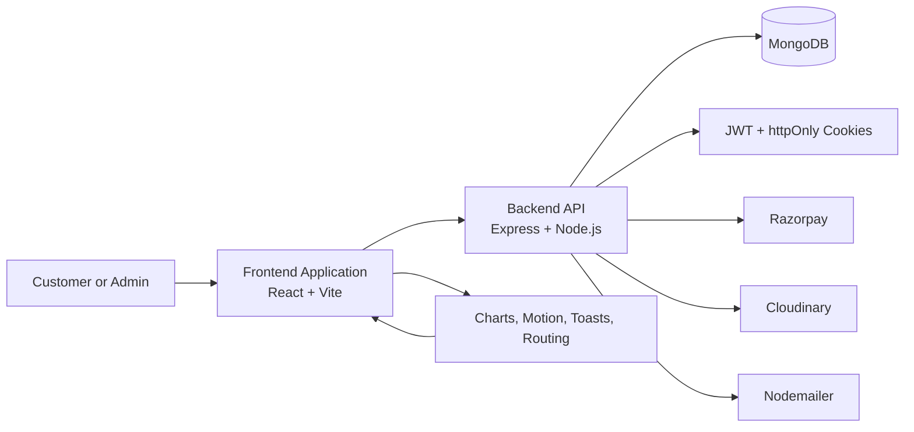
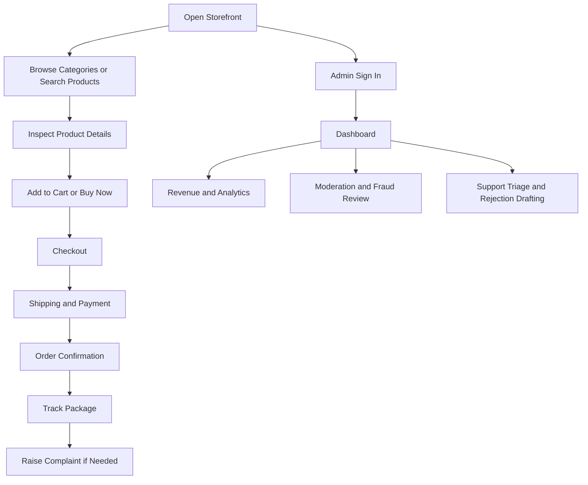

# ShopSphere India

ShopSphere India is a full-stack Indian e-commerce platform built on the MERN stack and designed as a premium storefront with a modern customer experience and an operationally rich admin layer.

[](https://vitejs.dev/)
[](https://expressjs.com/)
[](https://www.mongodb.com/)
[](LICENSE)

## Executive Summary

The application combines a polished shopping experience with a command-center style administration suite. Customers can browse products, manage carts, complete multi-step checkout, track orders, and raise complaints. Admin users can review analytics, manage moderation, inspect fraud signals, and orchestrate support workflows from a single interface.

The repository is organized as a two-tier system:

- `backend/` provides the REST API, persistence, authentication, and payment integration.
- `frontend/` delivers the customer-facing storefront and the administrative control panel.

## Platform Overview



## User Journey



## Feature Matrix

| Area | Capability | Notes |
| --- | --- | --- |
| Storefront | Product browsing | Category-based exploration with search and filtering |
| Cart | Persistent shopping cart | Supports quantity updates and saved sessions |
| Checkout | Multi-step flow | Shipping, payment, review, and confirmation |
| Auth | Secure account access | JWT-based authentication with protected routes |
| Orders | Tracking and status visibility | Dedicated order journey and tracking screens |
| Support | Complaint handling | User complaint submission and threaded follow-up |
| Admin | Analytics dashboard | Recharts-powered operational views |
| Admin | Moderation and fraud tools | AI-assisted review workflows and flag handling |
| UI | Motion and feedback | Framer Motion animations and toast notifications |

## Capability Charts

The following bars summarize the breadth of the platform in a readable, documentation-friendly format.

| Capability | Coverage |
| --- | --- |
| Customer Commerce | #################### 100% |
| Product Catalog | ################### 95% |
| Checkout & Payments | ################### 95% |
| Authentication & Security | ################## 90% |
| Order Management | ################## 90% |
| Complaints & Support | ################# 85% |
| Admin Analytics | ################### 95% |
| Moderation / Fraud Review | ################# 85% |

## Technical Stack

| Layer | Technology |
| --- | --- |
| Frontend | React 19, Vite, Tailwind CSS, Framer Motion |
| State Management | Redux Toolkit, RTK Query |
| Backend | Node.js, Express.js |
| Database | MongoDB, Mongoose |
| Authentication | JWT, bcryptjs, httpOnly cookies |
| Payments | Razorpay |
| Media | Cloudinary |
| Notifications | React Hot Toast |
| Visualization | Recharts |
| Forms and Validation | Built-in React forms and server-side validation |

## Repository Structure

```text
ShopSphereIndia/
├── backend/
│   ├── config/        # Database and server configuration
│   ├── controllers/   # Request handlers and business logic
│   ├── data/          # Seed datasets and curated product catalogs
│   ├── middleware/    # Authentication and error handling
│   ├── models/        # Mongoose schemas
│   ├── routes/        # API route definitions
│   ├── utils/         # Shared helpers such as token generation
│   ├── seeder.js      # Seed execution entry point
│   └── server.js      # Backend application entry point
├── frontend/
│   ├── public/        # Static assets
│   └── src/
│       ├── components/ # Layouts, cards, loaders, and shared UI
│       ├── pages/      # Public pages, account flows, order views
│       ├── pages/admin/ # Administrative control surfaces
│       └── redux/      # Store, slices, and RTK Query services
└── README.md
```

## Core Product Areas

The storefront is intentionally broad and operationally realistic:

- Shopping cart and direct purchase flow.
- Search, category browsing, rating-based product discovery, and product badges.
- Secure login, registration, profile updates, and password management.
- Order creation, delivery tracking, and complaint filing.
- Administrative dashboards for revenue, moderation, fraud, and support triage.
- AI-assisted workflows for operational drafting and decision support.

## Live Demo

| Service | URL |
| --- | --- |
| Frontend | https://shopsphere-india.vercel.app |
| Backend API | https://shopsphereindia.onrender.com |

## Local Development

### Prerequisites

- Node.js 18 or newer
- MongoDB Atlas or a local MongoDB instance

### Backend Setup

```bash
cd backend
npm install
```

Create a `backend/.env` file with the following values:

```env
NODE_ENV=development
PORT=5000
MONGODB_URI=mongodb://127.0.0.1:27017/shopsphere
JWT_SECRET=your_super_secret_key_here
CLIENT_URL=http://localhost:5173
CLIENT_URLS=http://localhost:5173
RAZORPAY_KEY_ID=your_razorpay_key_id
RAZORPAY_KEY_SECRET=your_razorpay_key_secret
GOOGLE_CLIENT_ID=your_google_oauth_client_id
SMTP_HOST=your_smtp_host
SMTP_PORT=587
SMTP_SECURE=false
SMTP_USER=your_smtp_user
SMTP_PASS=your_smtp_password
SMTP_FROM=ShopSphere India <no-reply@shopsphere.local>
TWILIO_ACCOUNT_SID=your_twilio_account_sid
TWILIO_AUTH_TOKEN=your_twilio_auth_token
TWILIO_FROM_NUMBER=+15550000000
```

If SMTP or Twilio credentials are not configured in development, OTP codes are printed to the backend terminal so you can still test the flow locally.

Start the backend:

```bash
npm run dev
```

### Frontend Setup

```bash
cd frontend
npm install
npm run dev
```

The frontend runs on the Vite development server, typically at `http://localhost:5173`.

If you want Google sign-in to work locally, add `VITE_GOOGLE_CLIENT_ID` to `frontend/.env` with the OAuth client id from your Google Cloud project.

## Seed Data

The backend includes curated seed content for the product catalog. To initialize sample data, run the seeder from the backend directory after configuring your environment variables:

```bash
cd backend
node seeder.js
```

## Deployment

### Backend Deployment on Render

The repository includes a Render configuration at [render.yaml](render.yaml). The service is set up with:

- Root directory: `backend`
- Build command: `npm install`
- Start command: `node server.js`
- Health check path: `/`

Required environment variables:

- `NODE_ENV=production`
- `MONGODB_URI`
- `JWT_SECRET`
- `CLIENT_URL`
- `CLIENT_URLS`
- `RAZORPAY_KEY_ID`
- `RAZORPAY_KEY_SECRET`

### Frontend Deployment on Vercel

1. Import the repository into Vercel.
2. Set the root directory to `frontend`.
3. Configure the frontend environment variable that points to the deployed API.
4. Deploy the Vite build output through Vercel’s standard workflow.

## Demo Credentials

| Role | Email | Password |
| --- | --- | --- |
| Admin | admin@shopsphere.com | password123 |
| User | john@example.com | password123 |

## Formal Notes

This README is written to serve both technical reviewers and stakeholders. It emphasizes the system layout, product surface area, operational workflows, and deployment boundaries so the repository can be evaluated without opening the codebase first.

## License

MIT © 2024 Naman Upadhyay
